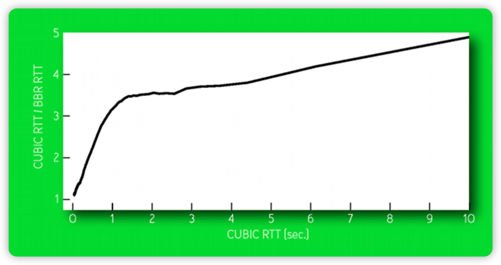

# QUIC with CUBIC or BBR

## 拥塞控制

拥塞控制算法是 TCP/QUIC 协议的一个基础部分，多年来经过一个个版本的迭代（如 Tahoe、Reno、Vegas 等），拥塞控制算法得到了持续的提升。由于篇幅有限，本文就目前比较流行的两种拥塞控制算法（CUBIC，BBR)，也是 MSQUIC 目前支持的拥塞控制算法进行介绍。

太多太快的分组（包含着 TCP 段以及 UDP 数据报等) 需要网络传输，超过网络 (具体来可能是部分节点、链路) 的处理能力，网络中的某个(某些)路由器队列溢出，开始丢弃分组。
从源端的角度来看:

- 分组丢失，源端超时了
- 在源端，收到某 TCP 段的多个冗余ACK
- 延迟增加
- 拥塞情况加速变坏
- 不加控制网络将无法使用

## CUBIC 拥塞控制思路

CUBIC 是一种拥塞控制协议。TCP CUBIC 版本目前已经作为默认的拥塞控制算法被应用在 linux/unix 系统中，微软在 Win10/Windows Server 2019 系统也对 CUBIC 做了支持。CUBIC 的提出得益于当今通信链路往往具有越来越高的带宽水平这一事实。在由高带宽链路组成的网络中，缓慢增加传输速率的拥塞控制算法可能最终会浪费链路的容量。CUBIC 改变了现有 TCP 标准中的线性拥塞窗口增长函数为三次函数，以提高 TCP 在快速和长距离网络上的可扩展性。它还通过使窗口增长独立于 RTT（往返时间）在具有不同 RTT（往返时间）的流量之间实现更公平的带宽分配，因此这些流量以相同的速率增加其拥塞窗口。在稳定状态下，当窗口远离饱和点时，CUBIC 会以更快的速率增加拥塞窗口的大小，在接近饱和点时缓慢增加窗口大小。这些特征使得 CUBIC 在带宽较大时变得极具扩展性，而延迟较高时也有很好的稳定性。为了实现这一点，提出根据三次函数建立增加和减少传输速率的方案。让我们看看下图：


算法步骤如下：
- 在发生拥塞事件时，该瞬间的窗口大小将被记录为 Wmax 或最大窗口。
- Wmax 值将被设置为控制拥塞窗口增长的三次函数的拐点。
- 然后，将使用较小的窗口值重新启动传输，如果没有拥塞，该值将根据三次函数的凹形部分增加。
- 随着窗口接近 Wmax，增量将减慢。
- 一旦达到临界点，即 Wmax，窗口值将继续谨慎增加。
- 最后，如果网络仍然没有遇到任何拥塞，则窗口大小将根据函数的凸形部分继续增大。如我们所见，CUBIC 的策略是开始时快速增加，在上一次导致拥塞的窗口周围减小，然后继续以大增量增加。
如果你想了解更多 CUBIC 算法的技术细节，可以阅读下面的文章：[CUBIC: a new TCP-friendly high-speed TCP variant](https://www.cs.princeton.edu/courses/archive/fall16/cos561/papers/Cubic08.pdf)

BBR 拥塞控制思路

不同于 CUBIC 等基于丢失的拥塞控制算法，BBR 是基于模型的拥塞控制算法，其行为方式是对传输流通过的网络路径的确切模型的表现。模型将通信分成应用受限、带宽受限等阶段。主要包括两个估计参数：
- BtlBw：传输通道的瓶颈带宽，通路的容量，用来估算自滑动窗口的最大传发送速率样本。
- RTprop：该路径的往返传播延时，轻载时，各队列都没有排队情况下的往返传播传输延迟之和，用来估算自滑动窗口的最小往返延时样本。
经常测量 BtlBW 和 RTprop，用来计算 BDP（带宽延迟积，反映网络通信量和路由的变化），按照 BtlBW 控制主机注入速率，按照BDP控制 inflight 的数量。其中：
```
BDP = RTprop * BtlBW
```
从源端注入的等待被确认的 inflight 数据不超过 BDP。
因为 BtlBW 和 RTprop 不可同时测量
- inflight 小于 BDP 才能够测量 RTprop，轻载时的往返延迟
- inflight 大于 BDP，才能够测量 BtlBW
因此该算法基于网络的时间局部性，即从一小段时间来看，系统参数基本稳定，大概率能测准和控好 BtlBW 和 RTprop。

**应用受限阶段，测量 RTprop**：
- 交互式应用：应用数据不多，本身就在该阶段 RTprop WR=10s 有更新，不用单独测量 RTprop 。
- 高突发情况：RTprop 近10s没有更新，2% 的时间（200 ms) 降低速率，形成条件测量 RTprop，适应路由变化。

**带宽受限阶段，测量 BtlBW**：
- 连接建立后不断增加 inflight 量，连续三个 RTprop 交付速率不增加25%进入带宽受限状态。
- 测量交付速率，将近期最大的交付速率当作  BtlBW。在高带宽通信时，适应瓶颈链路带宽的变化。

**按照 BtlBW 控速**：
- inflight 不超过BDP 前提下，且控制分组间隔，使得超过瓶颈链路带宽 BtlBW。
- 计算分组之间的发送间隔:
```
pacing_rate = pacing_gain * BtlBW
```
**适应 BtlBW 变化**：
- 在带宽受限阶段 周期性地增速适应BtlBW的增加。一个 Cycle 8个节拍(RTprop)，
- 一个节拍 pacing_gain=1.25，增速(1.25*BDP)，如 RTprop 没变大=>交付速率增加，BtlBW 按公式更换成更大的交付速率。如 RTprop 变大=>交付速率没变大，BtlBW 不更新 
- 一个节拍RTprop，0.75倍 BDP，放空瓶颈 buffer
余下6个节拍原有速度，稳定

整个的过程可以看作是下面的状态机模型
```
        |
        V
+--->Startup----+
|       |       |
|       V       |
|     Drain-----+
|       |       |
|       V       |
+--->ProbeBW----+
|    ^     |    |
|    |     |    |
|    +-----+    |
|               |
+----ProbeRT<---+
```
细节可参考 [BBR: Congestion-Based Congestion Control](https://queue.acm.org/detail.cfm?ref=rss&id=3022184)

## BBR VS CUBIC

2015年谷歌 B4 网络，从 CUBIC 迁移到 BBR
BBR吞吐量是 CUBIC 的2-25倍，如果将接收端的缓冲区大小加大，BBR 是 CUBIC 吞吐的133倍。

丢包率在0.001%到50%情况下，CUBIC 吞吐量下降是 BBR 的10倍以上，随机丢包率越高，BBR 吞吐优势越大，0.1% 丢包率，BBR 吞吐量是 CUBIC 的 100 倍。

CUBIC 相对于 BBR 延迟的倍数。

移动通信场景在缓存加大情况下 CUBIC 随着 Buffer 增大，延迟增大，而 BBR 随着 buffer 增 大几乎不增加。采用CUBIC连接超时概率大。


公平性:与基于丢失的拥塞控制算法的竞争
- 基于丢失的拥塞控制倾向于占满队列，让分组丢失 • 影响BBR的运行，尽管BBR与CUBIC共同运行不吃亏
- 本质上BtlBW降低，本质上靠着10RTT超时之前的持续注入，让队列丢失
- 让CUBIC超时，退缩，但整网效果受限